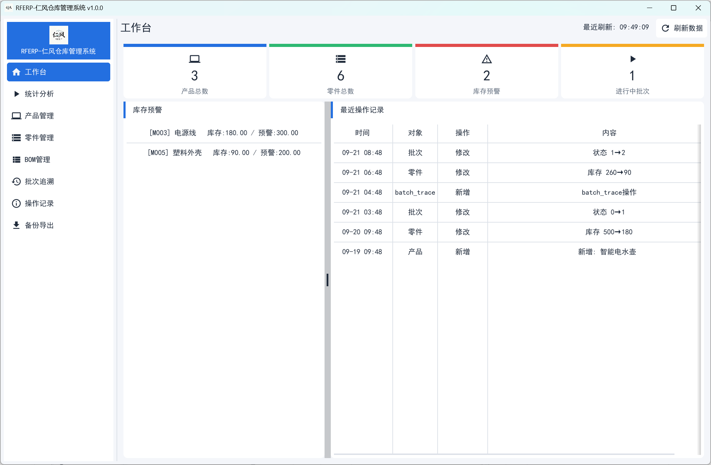

# RFERP-仁风仓库管理系统

面向小微生产的**进销存与批次追溯**桌面应用，覆盖产品、零件、BOM、生产批次、库存、审计日志与数据备份导出。

使用 **Go + Fyne** 构建，数据存储于 **MySQL**，支持一键安装与自动更新。

---

## 界面预览



---

## 功能特性

- **产品 / 零件管理**：编码、规格、单位、状态、库存预警
- **BOM 管理**：产品与零件的用量关系、损耗率、可替换与用量模式
- **生产批次**：计划 / 已产数量、批次状态流转、投料记录
- **批次追溯**：按产品批次或零件追溯用料来源
- **库存管理**：入库、出库、盘点、预警列表
- **审计日志**：关键数据的变更前后记录
- **备份导出**：数据库备份（SQL）与各表导出（CSV）

---

## 下载安装

1. 打开 [最新版本](https://github.com/LzYita/RFERP/releases/latest)
2. 下载 `Setup-RFERP-x.y.z.exe`
3. 双击安装（中文界面，可自选安装路径）

> 系统要求：**Windows 10 / 11（64 位）**

---

## 首次运行

程序首次启动会打开**配置向导**：

1. 自动检测本机 MySQL（服务名、端口、`mysqldump` 路径）
2. 填写连接信息（主机、端口、用户名、密码、数据库名）
3. 点击「初始化并启动」：
   - 自动创建数据库与数据表
   - 使用 root 连接时，自动创建专用最小权限账号
   - 连接信息以 **Windows DPAPI 加密**后保存在本机

> 若本机尚未安装 MySQL，向导提供官方安装器下载入口。

---

## 自动更新

- 程序启动后会自动检查新版本
- 更新包与更新清单使用 **Ed25519 签名**校验，签名不符则拒绝更新
- 发现新版本时弹窗提示，可选择立即更新

---

## 从源码构建

### 依赖
- [Go](https://go.dev/) 1.22+
- GCC（CGO 需要，如 [TDM-GCC](https://jmeubank.github.io/tdm-gcc/)）
- 构建安装包需 [Inno Setup 6](https://jrsoftware.org/isdl.php)

### 构建
```bat
build.bat
```
产物：`RFERP.exe`

> 脚本通过系统 PATH 查找 `go` / `gcc` / `gh` / `ISCC`，并相对脚本自身目录运行，可在任意路径执行。
> 如需覆盖，可设置环境变量：`GOROOT`、`GCC_DIR`、`GH`、`ISCC`。

### 构建安装包
```bat
build-installer.bat
```
产物：`dist\Setup-RFERP-<版本>.exe`

---

## 技术栈

| 层 | 技术 |
|---|---|
| 语言 | Go |
| 桌面 UI | Fyne v2 |
| 数据库 | MySQL 8.0 |
| 凭据保护 | Windows DPAPI |
| 更新签名 | Ed25519 |
| 安装包 | Inno Setup 6 |

---

## 目录结构

```
cmd/
  desktop/       程序入口
  keygen/        生成更新签名密钥对
  signmanifest/  生成并签名更新清单
internal/
  config/        配置加载与加密保存
  secret/        DPAPI 加解密
  repository/    数据访问
  service/       业务逻辑
  migrate/       版本化数据库迁移
  update/        自动更新
  ui/            界面
  ...
setup.iss        安装包脚本
build*.bat       构建脚本
release.bat      发布脚本
```

---

## 许可证

本项目未指定开源许可证。如需使用、分发或修改，请先与作者联系。
